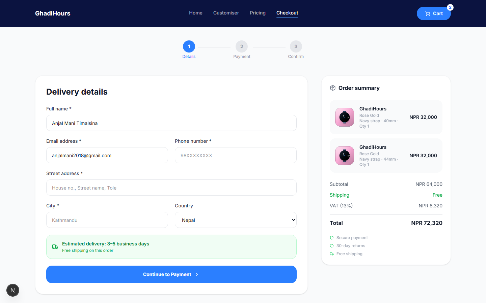
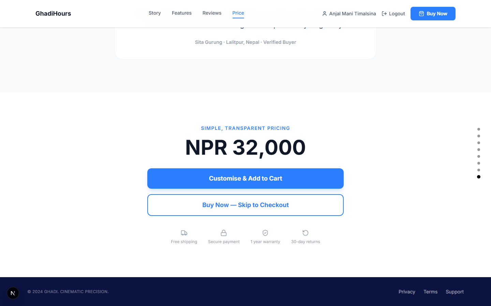
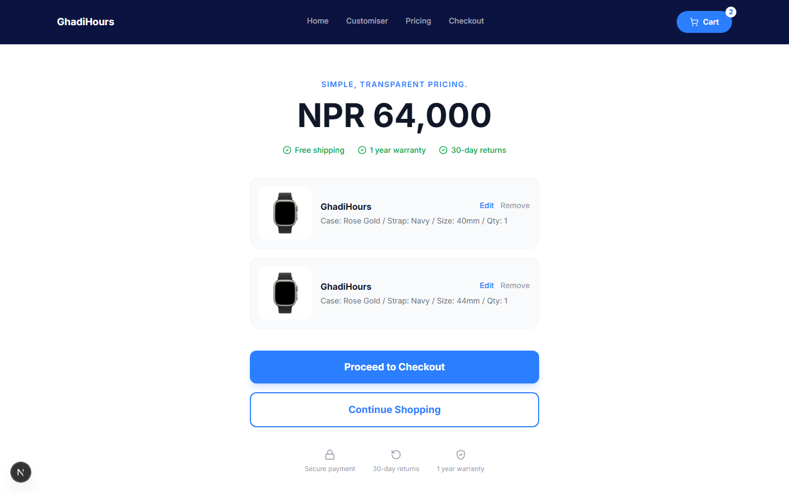
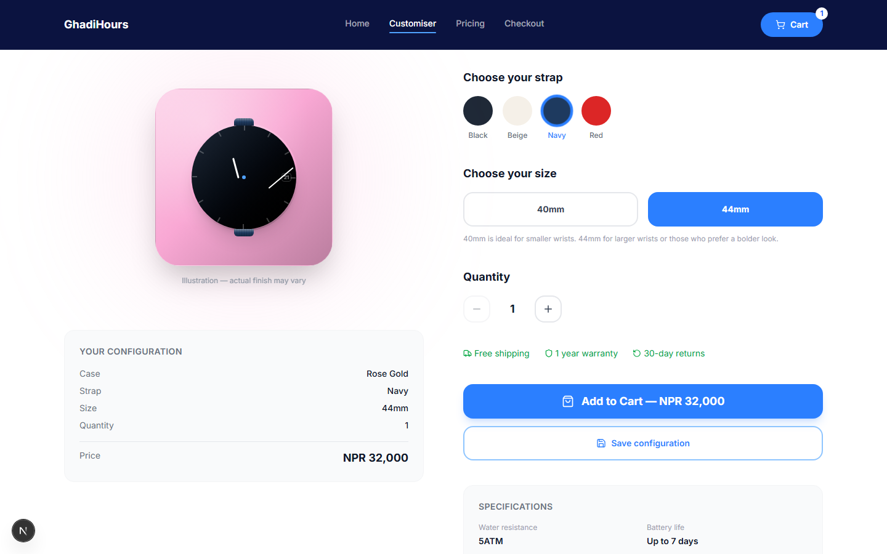
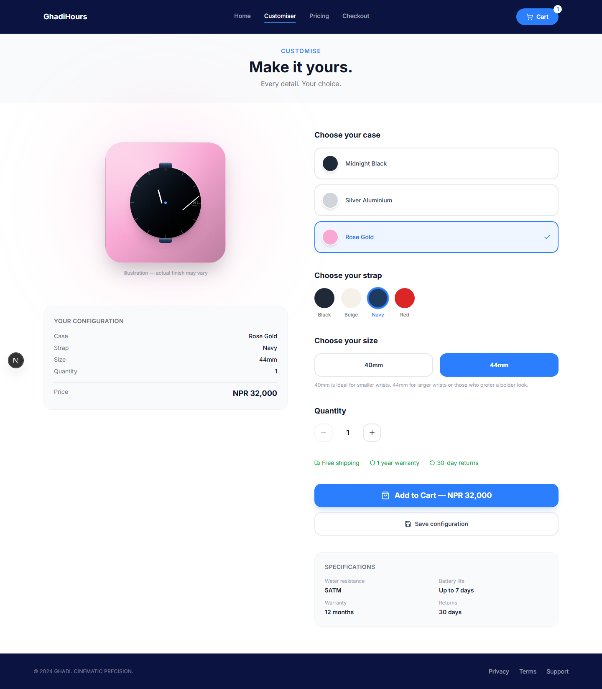
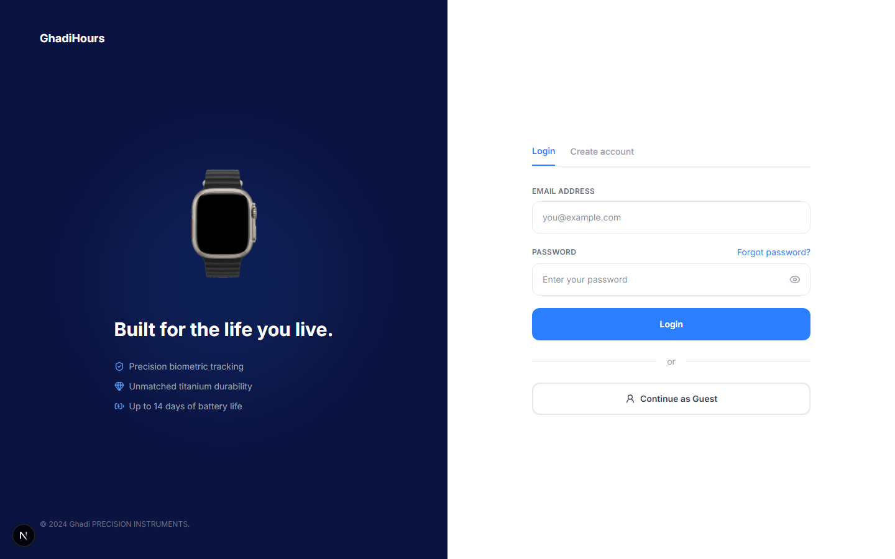
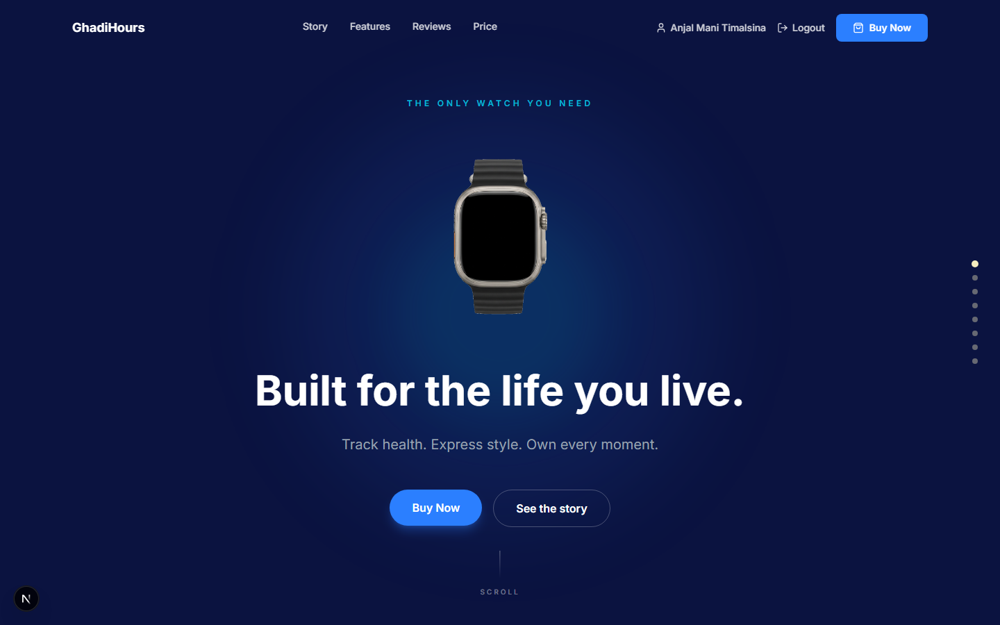
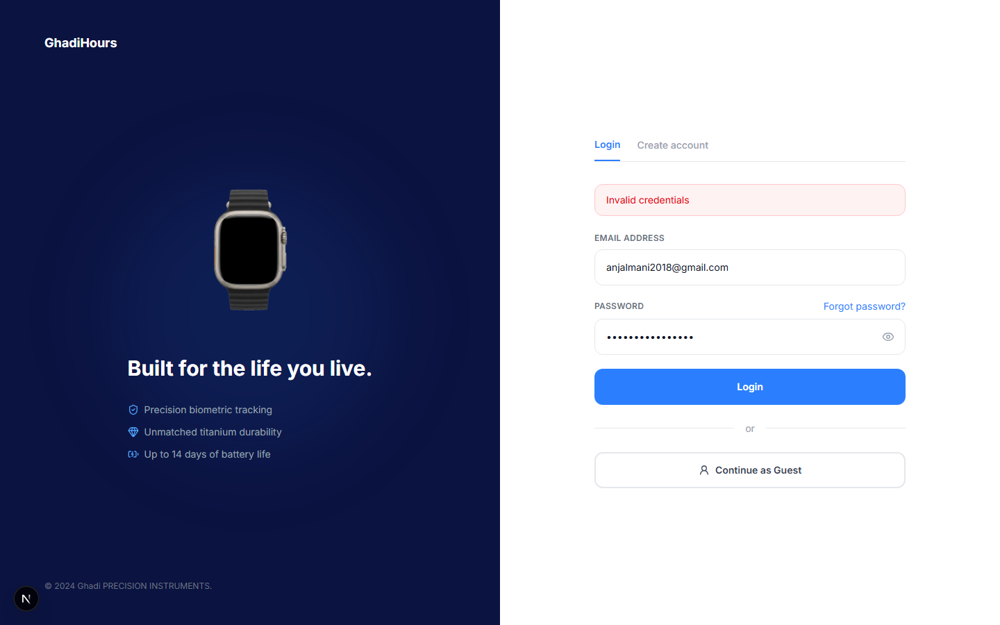

# GhadiHours — UX Documentation

> Screenshots in this document were captured directly from the running application (`frontend/` + `backend/`) rather than mockups, so they reflect the actual current behaviour of the product.

---

## 6. Nielsen's 10 Heuristic Evaluation

Each heuristic below is evaluated against a real screen or interaction in GhadiHours, with a screenshot, an honest assessment of how well it's implemented, and concrete improvements where the implementation falls short.

---

### 6.1 Visibility of System Status

**Principle.** The system should always keep users informed about what is going on, through appropriate feedback within a reasonable time. Users shouldn't have to guess whether an action succeeded, is in progress, or failed.

**Evaluation.** The checkout flow uses a persistent 3-step indicator (*Details → Payment → Confirm*) that fills in as the user progresses, so they always know where they are and how much is left. The navbar's cart icon carries a live badge count that updates the instant an item is added or removed, without a page reload. Elsewhere in the product, the same pattern repeats: the customizer's "Add to Cart" button switches to "Adding…" while the request is in flight, and the admin order-status dropdown disables itself while a save is pending so two clicks can't race each other.

**Improvements.**
- The order-status progress tracker on the customer's "My Orders" page is static once rendered — it doesn't poll or use a live connection, so a status change made by an admin isn't reflected until the customer manually refreshes.
- Toasts (e.g. "Thanks! Your review is pending approval") disappear after a fixed 4 seconds with no way to dismiss early or re-read them if missed.

---

### 6.2 Match Between System and the Real World

**Principle.** The system should speak the users' language, with words, phrases, and concepts familiar to them, rather than system-oriented terms. Follow real-world conventions, making information appear in a natural and logical order.

**Evaluation.** Pricing is shown in NPR (the local currency for the target market), not an abstract unit. Trust indicators use universally recognised metaphors — a truck for shipping, a lock for secure payment, a shield for warranty, a circular arrow for returns — so users don't have to read labels to understand the gist. Button copy uses plain retail language ("Buy Now — Skip to Checkout", "Continue as Guest") instead of technical phrasing.

**Improvements.**
- "Customise & Add to Cart" and "Buy Now — Skip to Checkout" are both prominent primary-looking actions; a first-time user unfamiliar with the product may not immediately grasp that one skips configuration entirely.
- Delivery estimates say "3–5 business days" without pinning it to an actual date, which is slightly more abstract than users are used to on major retail sites (e.g. "Arrives Monday, July 20").

---

### 6.3 User Control and Freedom

**Principle.** Users often perform actions by mistake and need a clearly marked "emergency exit" to leave the unwanted action without going through an extended process. Support undo and redo.

**Evaluation.** Every cart line item has an independent **Edit** (back to the customizer with that configuration) and **Remove** action, so a mis-click during configuration is never a dead end. **Continue Shopping** sits right next to **Proceed to Checkout** as an equally-sized, equally-visible option — the user is never funneled into checkout without an easy way back. Modals (Write a Review, New Customer) all have an explicit close (✕) affordance in addition to a backdrop click.

**Improvements.**
- There's no "Undo" after removing a cart item — it's deleted immediately with no brief grace period or confirmation, which is risky for a destructive action performed with a single click.
- The checkout flow's "← Back to details" (step 2 → step 1) preserves form data, but there's no equivalent way to jump backward from step 3 (Confirm) without using the browser's back button.

---

### 6.4 Consistency and Standards

**Principle.** Users shouldn't have to wonder whether different words, situations, or actions mean the same thing. Follow platform and industry conventions.

**Evaluation.** The same dark `FlowNavbar` (Home / Customiser / Pricing / Checkout + cart button) appears unchanged across the customizer, cart, and checkout — the screenshot above (checkout) is visually identical in structure to the customizer and cart pages captured elsewhere in this document. Primary actions are consistently blue, filled, and pill/rounded-rectangle shaped throughout the whole site, including the separate admin panel (which reuses the same button and badge language, just with its own sidebar layout). Status pills (Order Placed / Processing / Shipped / Delivered, and the review Pending / Approved / Hidden states) use the same colour-coding logic — gray → yellow/orange → blue → green — everywhere they appear.

**Improvements.**
- The marketing site's `Navbar` (Story/Features/Reviews/Price, used on the public homepage) and the logged-in `FlowNavbar` (Home/Customiser/Pricing/Checkout, used in the shopping flow) are two different navigation components with different link sets and different visual weight. This is intentional (different context, different priorities) but is worth calling out as a place where "consistency" was deliberately traded for task-focus — it should be a documented decision, not an oversight.
- The admin sidebar uses `Sign out`; the customer-facing navbar uses `Logout`. These should be unified to one term.

---

### 6.5 Error Prevention

**Principle.** Even better than good error messages is a careful design which prevents a problem from occurring in the first place. Either eliminate error-prone conditions, or check for them and present a confirmation option before the user commits.

**Evaluation.** Rather than a free-text quantity field (which would allow 0, negative numbers, or non-numeric input), the customizer uses a stepper with the **−** button disabled the instant quantity reaches 1, and an implicit ceiling of 10 — invalid states are structurally impossible rather than merely validated after the fact. The same philosophy governs case colour, strap colour, and size: all are constrained-choice buttons/swatches, never free text, so a customer can never submit a nonsensical or unstocked combination through the UI. On the backend, `createOrder` independently re-validates stock for every line item before committing, so even a stale client-side cart can't create an order for a variant that just sold out.

**Improvements.**
- "Remove" on a cart item has no confirmation step — for a destructive action, a lightweight confirm (or the undo pattern noted in 6.3) would reduce accidental data loss.
- The admin's Approve/Hide review actions are similarly one-click with no confirmation, which is appropriate for reversible actions but was not a deliberate distinction — it should be documented as such rather than assumed.

---

### 6.6 Recognition Rather Than Recall

**Principle.** Minimize the user's memory load by making elements, actions, and options visible. The user should not have to remember information from one part of the interface to another.

**Evaluation.** This is one of the strongest heuristics in the product. The customizer never asks the user to remember what they picked: the selected case shows a checkmark and blue border directly on the swatch, and a persistent "Your Configuration" summary card mirrors every choice (case, strap, size, quantity, live-updating price) in plain text at all times. The live watch preview recolors in real time to match the exact selection, so the user is recognising their choice visually, not recalling a colour name. Labels are uppercase and explicit ("EMAIL ADDRESS", "PASSWORD") rather than relying on icon-only or placeholder-only inputs that vanish once the user starts typing.

**Improvements.**
- Once a customer navigates away from the customizer to the cart, the "Edit" link takes them back into the customizer but doesn't visually indicate this is the same item they were editing versus a fresh configuration — a brief "Editing: Rose Gold / Navy / 40mm" banner would remove any doubt.

---

### 6.7 Flexibility and Efficiency of Use

**Principle.** Accelerators — unseen by novice users — may speed up the interaction for expert users, such that the system can cater to both inexperienced and experienced users. Allow users to tailor frequent actions.

**Evaluation.** The login screen offers three distinct paths from one place: sign in with an existing account, switch to the account-creation tab without a page reload, or **Continue as Guest** to skip authentication entirely and go straight to checkout. This directly serves two very different users — a returning customer who wants speed, and a first-time buyer who doesn't want the friction of registering. The admin Orders page adds a second layer of efficiency for power users: a live search box plus status filter tabs let an admin narrow 40+ orders down instantly instead of scrolling, and clicking "View Orders" from a customer row deep-links straight into that filtered view.

**Improvements.**
- There are no keyboard shortcuts anywhere in the admin panel (e.g. `/` to focus search, `Esc` to close the order detail panel) — for an admin processing many orders a day, this is a real efficiency gap.
- The customizer has no "quick reorder" from a past order — a returning customer who liked their last configuration has to rebuild it from scratch.

---

### 6.8 Aesthetic and Minimalist Design

**Principle.** Interfaces should not contain information that is irrelevant or rarely needed. Every extra unit of information competes with the relevant units and diminishes their relative visibility.

**Evaluation.** The hero commits to one message at a time: an eyebrow line, one product visual, one headline, one subheading, two clearly-differentiated CTAs (primary filled / secondary outline), and nothing else competing for attention. This restraint was a deliberate design decision applied consistently — for example, the Pricing section's trust badges were originally duplicated in two separate rows and were consolidated into one during this project specifically to remove redundant, competing information (a direct application of this heuristic).

**Improvements.**
- The fixed side dot-navigation on the homepage is a nice wayfinding aid but is one more persistent UI element competing for attention on an otherwise very clean hero; it could fade out except when actively scrolling.

---

### 6.9 Help Users Recognize, Diagnose, and Recover from Errors

**Principle.** Error messages should be expressed in plain language (no error codes), precisely indicate the problem, and constructively suggest a solution.

**Evaluation.** Failed login shows a plain-language inline banner rather than a generic alert or silent failure. Elsewhere, error handling follows the same plain-language principle: attempting a second product review returns *"You've already reviewed this product"* rather than a raw HTTP status; attempting to order an unstocked variant returns *"Rose Gold / Navy / 40mm is out of stock"*, naming the exact configuration rather than a generic failure. Required checkout fields are validated together with a single clear message ("Please fill in all required fields") before the request is even sent.

**Improvements.**
- The current login error banner reads simply "Invalid credentials" — it doesn't clarify *which* field is likely wrong or suggest the next step (e.g. a "Forgot password?" nudge directly inside the error, not just as a standing link above it).
- Several error paths still fall back to a generic `alert()` browser dialog (e.g. "Couldn't update order status.") — these are functional but visually inconsistent with the rest of the product's design language and should be migrated to the same inline banner style used elsewhere.

---

### 6.10 Help and Documentation

**Principle.** It's best if the system doesn't need additional explanation. However, it may be necessary to provide documentation to help users understand how to complete their tasks — this information should be easy to search, focused on the user's task, and not too large.

**Evaluation.** Contextual micro-help is used instead of a separate help centre: the size selector explains *"40mm is ideal for smaller wrists. 44mm for larger wrists…"* directly beneath the choice, at the exact moment it's needed. The checkout page states delivery expectations inline ("Estimated delivery: 3–5 business days") rather than requiring a trip to a shipping-policy page. The footer carries Privacy / Terms / Support links on every page, and the order-confirmation page adds "Need help? / Return policy / Contact us" directly beside the fresh order — help is offered right where doubt is most likely to occur, immediately after purchase.

**Improvements.**
- Privacy, Terms, and Support currently link to `#` (placeholder, non-functional) rather than real pages — this is the single biggest gap in this heuristic and should be prioritised before launch.
- There is no searchable FAQ or help centre at all; for a product involving payment and delivery, at minimum a short FAQ (return process, warranty claims, sizing) would reduce support-contact volume.

---

## 7. Development Methodology

### 7.1 Methodology Selection
- Agile Scrum

### 7.2 Sprint Planning
- Sprint structure

### 7.3 Project Management Tools
- Trello
- GitHub
- Figma
- FigJam

> *This section is outlined but not yet written — let me know when you're ready to fill in sprint details, board links, and cadence and I'll draft it in the same style as Section 6.*

---

## 8. UX Laws and Design Principles

> *Outline pending — select at least 10 laws (e.g. Fitts's Law, Hick's Law, Miller's Law, Jakob's Law, Law of Proximity, Law of Similarity, Von Restorff Effect, Peak-End Rule, Doherty Threshold, Aesthetic-Usability Effect) and I'll write each with a definition, application in GhadiHours, and supporting screenshots — most of these are already implemented in the product and referenced in code comments (e.g. `HeroSection.tsx`, `PricingSection.tsx`), so this section can reuse the screenshots already captured for Section 6 plus a few new ones.*

---

## 9. Conclusion

> *Pending — 250–350 words covering: summary of the UX process, key findings from this heuristic evaluation, impact of user feedback, achievement of project objectives, and future improvements. Best written last, once Sections 7 and 8 are final.*
